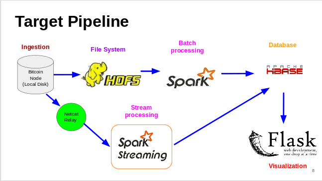
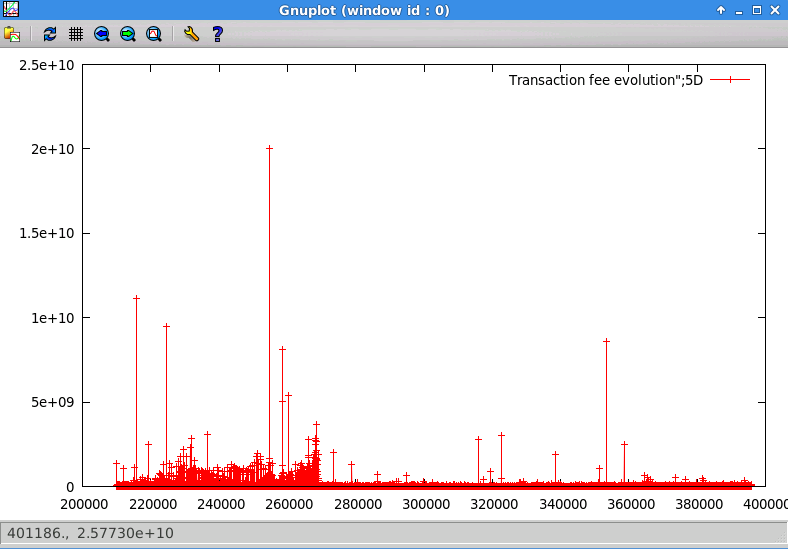

# Datafying Bitcoins
Datafying means putting data in a quantified form for tabulation and anlysis

## Goal ##
The idea of this breadth first project is to calculate the evolution of transaction fee in bitcoin blockchain using BigData tools. Transaction fee has become important as mining reward halfs every 210000 blocks. Currently the mining reward is 25 bitcoins, which will become 12.5 when the block count reaches 420000. At the time of writing this README.md, current block count is 398595. It is expected to reach 420000 blocks within next 3-4 months. To incentivize miners to verify transactions and include them in the blockchain, transaction fee has become important besides the mining reward. This project calculates this transaction fee for blocks 210000 and up till the current block count. This fee and the corresponding block number is then stored in the database. HBase is being used as the distributed database for storing this information.

## Setup ##
For this bitcoin node was locally run on AWS (Amazon webservices) EC2 nodes (1 master and 3 slave configuration). This means the entire block chain data (over 70 GB) was stored locally. Note Blockchain is fast growing and it has grown from 47 GB in December 2015 to 70 GB in February 2016. Running bitcoin node locally gives access to blockchain via Python RPC (Remote Procedure Call). Additionally, query is made to Toshi online API (https://bitcoin.toshi.io) to retrieve blockchain.Here is the BigData pipeline

- - - -

## Comparison ##
The project compares following three modes for latency, cost and throughput.
 1. Batch processing mode where whole or partial data is stored in HDFS
 2. Local Streaming mode where data is live streamed via Python RPC 
 3. Remote Streaming via API mode where relevant data is retrieved by HTTP get request

- - - -

- - - -
Here is a plot of the transaction fee evolution. Y-axis units are Satoshi (10e-8 bitcoin).X-axis are block numbers going from 210000 and up till current block number. It is odd that there is one block with transaction fee greater than 200 bitcoins !! Possible reasons might include sender forgeting to collect the change or urgency to confirm the transaction as soon as possible.

## Presentation ##
It is worth going through this first to get an idea about the scope of the work and the tools used.
http://bit.ly/slides_tariq

## Demo ##
Live Demo of the transaction fee calculator will be available soon. Please stay tuned.

## Credits ##
My heartfelt thanks to Victorsueca from #bitcoin channel on freenode. His input was extremely valuable in understanding some of the concepts. I also want to acknowledge midnightmagic and gijensen from #bitcoin as well for help in debugging bitcoind and other discussion.
